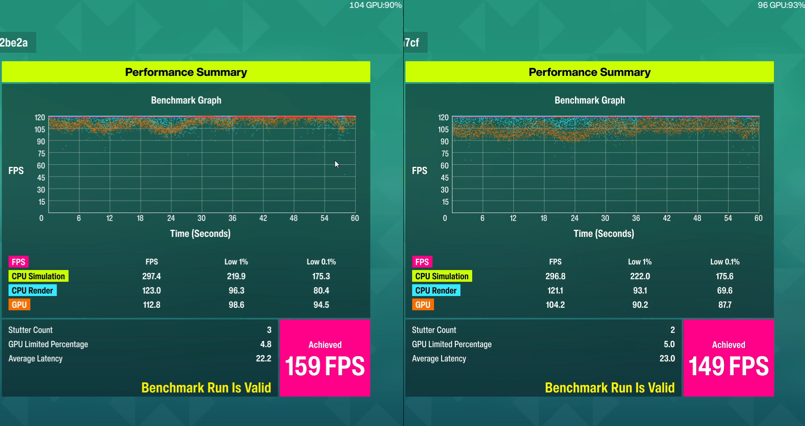
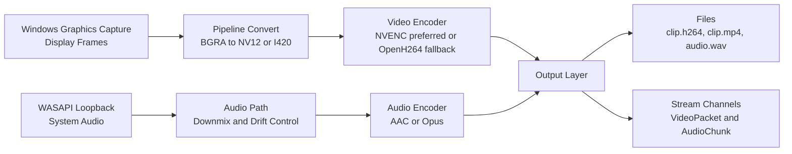
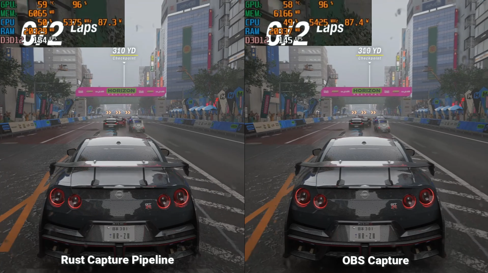

# rs-capture-pipeline

Windows-first screen + system-audio capture in Rust with hardware-friendly H.264 encoding, optional AAC/Opus audio, and embeddable streaming outputs.

This project is built around `capture-runtime`: a library you integrate into your own app (collab tool, recorder, streamer, native sender), plus a small reference CLI for local testing.

## Why this exists

If you're building a product, you often need a capture module rather than a full broadcaster app:

- Reliable Windows display capture (`WGC`)
- System audio capture (`WASAPI` loopback)
- Encoder fallback strategy (`NVENC` -> software)
- Files and/or encoded packet output you can route into your transport layer

This repo focuses on that layer. It does not include WebRTC signaling/transport logic.

## Demo and benchmark

- Full write-up (Forza benchmark vs OBS): [building a rust capture pipeline - benchmarking it against obs in forza](https://www.avyuktsoni.com/writing/rust-capture-pipeline-forza-benchmark-vs-obs)
- Comparison video (OBS vs pipeline): [YouTube demo](https://www.youtube.com/watch?v=JqCID-oWQjc)

## Media







## Architecture at a glance

1. Capture display frames with Windows Graphics Capture
2. Capture system audio with WASAPI loopback
3. Convert frames into encoder-friendly formats (NV12/I420)
4. Encode video (NVENC preferred, software fallback)
5. Encode audio (AAC or Opus)
6. Output to disk and/or stream channels (`VideoPacket`, `AudioChunk`)

## Features

- **Video path:** WGC + D3D11 texture flow, `NVENC` preferred with software fallback.
- **Audio path:** WASAPI loopback, multichannel downmix to stereo, optional presence emphasis.
- **Muxing/output:** MP4 (`H.264` + AAC when available), `clip.h264`, `audio.wav`.
- **Streaming-friendly API:** bounded `crossbeam_channel` outputs for host-owned transport stacks.
- **Runtime controls:** `RS_CAPTURE_*` environment configuration for fps, bitrate, codec, pacing, backpressure, and metrics.

## Platform and requirements

- **OS:** Windows 64-bit (current implementation target)
- **Rust:** toolchain pinned in [`rust-toolchain.toml`](rust-toolchain.toml)
- **GPU:** NVIDIA recommended for `NVENC`; software fallback available
- **Optional:** [FFmpeg](https://ffmpeg.org/) for post-mux flow via `RS_CAPTURE_FFMPEG_MUX=1`

## Quick start (CLI)

Build:

```bash
cargo build --release -p capture-pipeline-app
```

Run:

```bash
cargo run --release -p capture-pipeline-app -- [OUT_DIR] [FRAME_LIMIT] [noaudio]
```

Arguments:

- `OUT_DIR`: output directory (default `capture_out`)
- `FRAME_LIMIT`: number of frames, `0` runs until Ctrl+C
- `noaudio`: optional third argument to disable loopback capture

Example (60 fps target, run until stopped):

```powershell
$env:RS_CAPTURE_FPS="60"
cargo run --release -p capture-pipeline-app -- capture_out 0
```

## Expected outputs

When recording to files, the directory typically contains:

| File                  | Description                                                    |
| --------------------- | -------------------------------------------------------------- |
| `clip.h264`           | Raw H.264 elementary stream (Annex-B)                          |
| `clip.mp4`            | MP4 video (AAC track when Media Foundation AAC path is active) |
| `audio.wav`           | Float32 PCM capture mix                                        |
| `metrics.csv`         | Process metrics (CPU/RAM/FPS) when `RS_CAPTURE_METRICS != 0`   |
| `clip_with_audio.mp4` | Optional FFmpeg mux output when enabled                        |

## Use as a library (`capture-runtime`)

Add dependency:

```toml
[dependencies]
capture-runtime = { path = "path/to/rs-capture-pipeline/crates/capture-runtime", features = ["serde_config"] }
```

Then:

- Build `PipelineParams` from env/CLI helpers or `SessionConfig`
- Call `run_recording` / `run_file_recording` with a stop flag
- For stream mode, wire `stream_pair` and consume `VideoPacket` / `AudioChunk`
- Initialize COM (`MTA`) on the thread running capture

See full integration details in [`docs/INTEGRATION.md`](docs/INTEGRATION.md).

## Common environment variables

All runtime knobs live under `RS_CAPTURE_*` (implemented in [`crates/capture-runtime/src/env.rs`](crates/capture-runtime/src/env.rs)).

| Variable                                                                | Purpose                             |
| ----------------------------------------------------------------------- | ----------------------------------- |
| `RS_CAPTURE_FPS`                                                        | Nominal target fps (1-240)          |
| `RS_CAPTURE_VIDEO_BITRATE`                                              | Video bitrate in bps                |
| `RS_CAPTURE_AUDIO_CODEC`                                                | `aac` (default) or `opus`           |
| `RS_CAPTURE_AAC_BITRATE`                                                | AAC bitrate (default `192000`)      |
| `RS_CAPTURE_OPUS_BITRATE`                                               | Opus bitrate                        |
| `RS_CAPTURE_ENCODER` / `RS_CAPTURE_NVENC` / `RS_CAPTURE_NVENC_REQUIRED` | Video encoder policy                |
| `RS_CAPTURE_ASYNC_ENCODE`                                               | Enable async NVENC queue path       |
| `RS_CAPTURE_FRAME_PACING`                                               | Frame pacing sleep behavior         |
| `RS_CAPTURE_CFR`                                                        | CFR-like MP4 sample timing behavior |
| `RS_CAPTURE_STREAM_BACKPRESSURE`                                        | `block` or `drop` for stream queues |
| `RS_CAPTURE_PRESENCE_EMPHASIS`                                          | Mid/vocal emphasis in downmix path  |
| `RS_CAPTURE_AV_DRIFT_SAMPLES`                                           | A/V drift trim/pad threshold        |
| `RS_CAPTURE_METRICS`                                                    | Write `metrics.csv` (`0` disables)  |
| `RS_CAPTURE_FFMPEG_MUX`                                                 | Enable FFmpeg post-mux              |
| `RS_CAPTURE_NO_PRIORITY_BOOST`                                          | Disable priority boost in CLI       |

## Repository layout

| Path                                               | Role                                      |
| -------------------------------------------------- | ----------------------------------------- |
| [`crates/capture`](crates/capture)                 | WGC session and frame acquisition         |
| [`crates/pipeline`](crates/pipeline)               | Frame conversion and staging              |
| [`crates/encoder`](crates/encoder)                 | Video encoder registry and backends       |
| [`crates/audio`](crates/audio)                     | Loopback capture, downmix, WAV            |
| [`crates/audio_encoder`](crates/audio_encoder)     | AAC/Opus encode paths                     |
| [`crates/output`](crates/output)                   | MP4 writing and sample packaging          |
| [`crates/capture-runtime`](crates/capture-runtime) | Public embeddable API                     |
| [`crates/app`](crates/app)                         | Reference binary (`capture-pipeline-app`) |
| [`vendor/nvenc`](vendor/nvenc)                     | Patched NVENC crate                       |

## Documentation

- [`docs/INTEGRATION.md`](docs/INTEGRATION.md): embedder-first guide
- [`docs/GAME_BENCHMARK.md`](docs/GAME_BENCHMARK.md): benchmark workflow (OBS vs pipeline)
- [`CHANGELOG.md`](CHANGELOG.md): release notes and API changes

Generate rustdoc:

```bash
cargo doc -p capture-runtime --open
```

## Current status

This is production-oriented infrastructure software, but still actively evolving:

- Ready for limited Windows testing and integration feedback
- Known tuning work remains for capture/mux pacing in some 60 fps scenarios
- Transport remains host-owned by design (WebRTC/RTMP/etc. are out of scope here)

## License

`capture-runtime` uses `MIT OR Apache-2.0`. Confirm license declarations per crate before redistribution.
